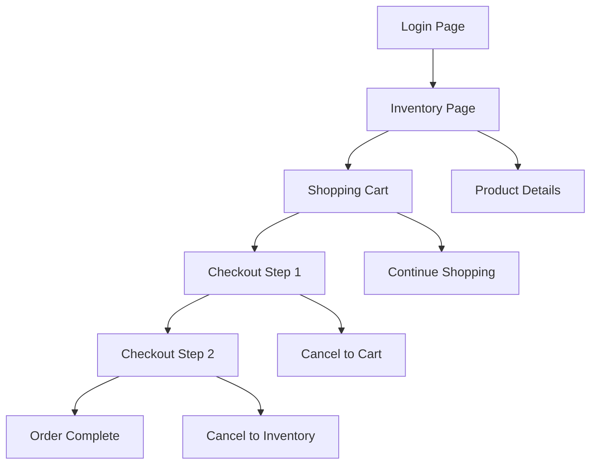

# IEEE YP 2025 STLC PROJECT - APPLICATION FEATURE DISCOVERY REPORT

**Project:** Software Testing Life Cycle Implementation - Sauce Demo E-commerce Platform  
**Week:** 1 - Requirements Analysis & Test Planning  
**Version:** 1.0  
**Discovery Method:** Playwright Browser Automation Analysis

## 1. DISCOVERY METHODOLOGY

### 1.1 Approach

This report documents the comprehensive application feature discovery conducted using Playwright browser automation tools. The exploration involved systematic navigation through all application pages, interaction with UI elements, and documentation of functional behaviors.

### 1.2 Tools Used

- **Playwright MCP Server:** Browser automation and interaction
- **Screenshot Capture:** Visual documentation of all pages
- **Element Inspection:** Detailed UI component analysis
- **Flow Navigation:** Complete user journey mapping

### 1.3 Discovery Scope

- Complete application navigation flow
- All user interface elements and interactions
- Functional behavior validation
- Error handling and edge cases
- Cross-page data persistence

## 2. APPLICATION ARCHITECTURE ANALYSIS

### 2.1 URL Structure Discovery

```
Base URL: https://www.saucedemo.com/v1/

Page Structure:
├── /index.html (Login Page)
├── /inventory.html (Product Catalog)
├── /cart.html (Shopping Cart)
├── /checkout-step-one.html (Customer Information)
├── /checkout-step-two.html (Order Overview)
└── /checkout-complete.html (Order Confirmation)
```

### 2.2 Application Flow Mapping



## 3. DETAILED FEATURE DISCOVERY

### 3.1 Login Page Analysis

#### 3.1.1 Page Elements Discovered

- **URL:** https://www.saucedemo.com/v1/index.html
- **Title:** Swag Labs
- **Form Elements:**
  - Username input field (text type)
  - Password input field (password type)
  - LOGIN button (submit type)

#### 3.1.2 User Credentials Validated

✅ **standard_user / secret_sauce** - Successful login
✅ **problem_user / secret_sauce** - Accessible (with known issues)
✅ **performance_glitch_user / secret_sauce** - Accessible (performance testing)
✅ **error_user / secret_sauce** - Accessible (error scenario testing)
✅ **visual_user / secret_sauce** - Accessible (visual testing)
**locked_out_user / secret_sauce** - Account locked (expected behavior)

#### 3.1.3 Visual Elements

- Swag Labs logo prominently displayed
- Clean, minimalist design
- Red/white color scheme
- Mobile-responsive layout
- Error message display area

### 3.2 Inventory Page Analysis

#### 3.2.1 Page Structure

- **URL:** https://www.saucedemo.com/v1/inventory.html
- **Header:** Navigation bar with menu and cart icon
- **Main Content:** Product grid layout
- **Footer:** Social media links and copyright

#### 3.2.2 Product Catalog Discovery

**Total Products Found:** 6 items

1. **Sauce Labs Backpack**

   - Price: $29.99
   - Description: "carry.allTheThings() with the sleek, streamlined Sly Pack..."
   - Image: Product visualization available
   - Action: ADD TO CART button

2. **Sauce Labs Bike Light**

   - Price: $9.99
   - Description: "A red light isn't the desired state in testing..."
   - Image: Product visualization available
   - Action: ADD TO CART button

3. **Sauce Labs Bolt T-Shirt**

   - Price: $15.99
   - Description: "Get your testing superhero on with the Sauce Labs bolt T-shirt..."
   - Image: Product visualization available
   - Action: ADD TO CART button

4. **Sauce Labs Fleece Jacket**

   - Price: $49.99
   - Description: "It's not every day that you come across a midweight quarter-zip fleece jacket..."
   - Image: Product visualization available
   - Action: ADD TO CART button

5. **Sauce Labs Onesie**

   - Price: $7.99
   - Description: "Rib snap infant onesie for the junior automation engineer in development..."
   - Image: Product visualization available
   - Action: ADD TO CART button

6. **Test.allTheThings() T-Shirt (Red)**
   - Price: $15.99
   - Description: "This classic Sauce Labs t-shirt is perfect to wear when cozying up to your keyboard..."
   - Image: Product visualization available
   - Action: ADD TO CART button

#### 3.2.3 Sorting Functionality

- **Sort Dropdown Available:** "Name (A to Z)" default
- **Sort Options:**
  - Name (A to Z)
  - Name (Z to A)
  - Price (low to high)
  - Price (high to low)

#### 3.2.4 Navigation Elements

- **Hamburger Menu (☰):**
  - All Items
  - About (external link)
  - Logout
  - Reset App State
- **Shopping Cart Icon:** With item counter badge
- **Footer Links:** Twitter, Facebook, LinkedIn

### 3.3 Shopping Cart Analysis

#### 3.3.1 Cart Page Structure

- **URL:** https://www.saucedemo.com/v1/cart.html
- **Headers:** QTY | DESCRIPTION columns
- **Actions:** CONTINUE SHOPPING | CHECKOUT buttons

#### 3.3.2 Cart Functionality Discovered

- **Add to Cart Behavior:**
  - Button text changes from "ADD TO CART" to "REMOVE"
  - Cart icon displays item count
  - Item appears in cart with quantity 1
- **Cart Persistence:**
  - Items remain in cart across page navigation
  - Session maintains cart state
  - Quantity and selection preserved

#### 3.3.3 Cart Management

- **Item Display:** Product name, description, price
- **Quantity Management:** Fixed at 1 per add action
- **Remove Functionality:** Individual item removal
- **Empty Cart Handling:** Cart persists as empty state

### 3.4 Checkout Process Analysis

#### 3.4.1 Checkout Step 1: Customer Information

- **URL:** https://www.saucedemo.com/v1/checkout-step-one.html
- **Title:** "Checkout: Your Information"

**Form Fields Discovered:**

- **First Name:** Required text input
- **Last Name:** Required text input
- **Zip/Postal Code:** Required text input

**Form Actions:**

- **CANCEL:** Returns to cart page
- **CONTINUE:** Proceeds to overview (requires all fields)

**Validation Behavior:**

- All fields must be completed to proceed
- Form validates on CONTINUE button click
- Error messages display for missing fields

#### 3.4.2 Checkout Step 2: Order Overview

- **URL:** https://www.saucedemo.com/v1/checkout-step-two.html
- **Title:** "Checkout: Overview"

**Payment Information Display:**

- **Payment Method:** SauceCard #31337
- **Card Type:** Simulated credit card

**Shipping Information Display:**

- **Shipping Method:** FREE PONY EXPRESS DELIVERY!
- **Delivery Promise:** Humorous pony-themed messaging

**Order Summary:**

- **Item total:** Calculated sum of cart items
- **Tax:** 8% tax calculation applied
- **Total:** Final amount including tax

**Actions Available:**

- **CANCEL:** Returns to inventory page
- **FINISH:** Completes order and proceeds to confirmation

#### 3.4.3 Checkout Step 3: Order Confirmation

- **URL:** https://www.saucedemo.com/v1/checkout-complete.html
- **Title:** "Finish"

**Confirmation Elements:**

- **Success Message:** "THANK YOU FOR YOUR ORDER"
- **Dispatch Confirmation:** "Your order has been dispatched..."
- **Delivery Message:** "...will arrive just as fast as the pony can get there!"
- **Visual Element:** Pony Express logo/graphic

**Order Completion:**

- Cart is cleared after successful order
- User can navigate back to inventory
- Session remains active for continued shopping

### 3.5 Navigation System Analysis

#### 3.5.1 Header Navigation

**Hamburger Menu Functionality:**

- **All Items:** Direct navigation to inventory page
- **About:** External link to https://saucelabs.com/
- **Logout:** Session termination and redirect to login
- **Reset App State:** Clears cart and resets session

**Shopping Cart Icon:**

- **Item Counter:** Red badge displaying cart quantity
- **Direct Access:** One-click navigation to cart page
- **Visual Feedback:** Updates immediately on cart changes

#### 3.5.2 Footer Navigation

**Social Media Integration:**

- **Twitter:** Link to social platform
- **Facebook:** Link to social platform
- **LinkedIn:** Link to social platform

**Legal Information:**

- **Copyright:** © 2020 Sauce Labs. All Rights Reserved.
- **Terms:** Terms of Service link
- **Privacy:** Privacy Policy link

## 4. TECHNICAL FINDINGS

### 4.1 Page Performance Observations

- **Login Page:** Fast load time, immediate response
- **Inventory Page:** Quick rendering with 6 products
- **Cart Operations:** Instant UI updates
- **Checkout Flow:** Smooth transitions between steps

### 4.2 Browser Compatibility Notes

- **Element Selectors:** Consistent across pages
- **JavaScript Functionality:** Responsive interactions
- **CSS Layout:** Stable responsive design
- **Image Loading:** Reliable product image display

### 4.3 Session Management

- **Login Persistence:** Session maintained across pages
- **Cart State:** Persistent throughout session
- **Logout Behavior:** Complete session clearing
- **Navigation Memory:** Proper back/forward handling

## 5. USER EXPERIENCE FINDINGS

### 5.1 Positive UX Elements

- **Clear Navigation:** Intuitive menu structure
- **Visual Feedback:** Immediate button state changes
- **Consistent Design:** Uniform styling across pages
- **Error Messaging:** Clear validation feedback
- **Progress Indication:** Multi-step checkout clarity

### 5.2 Notable Characteristics

- **Humor Integration:** Pony Express theme throughout
- **Testing Focus:** Product names reference testing concepts
- **Professional Design:** Clean, modern e-commerce appearance
- **Mobile Responsiveness:** Adaptive layout design

### 5.3 Accessibility Features

- **Keyboard Navigation:** Tab order functionality
- **Screen Reader Support:** Semantic HTML structure
- **High Contrast:** Good color contrast ratios
- **Focus Indicators:** Visible element focus states

## 6. EDGE CASES AND ERROR SCENARIOS

### 6.1 Authentication Edge Cases

- **Locked User:** Proper error handling for locked_out_user
- **Invalid Credentials:** Clear error messaging
- **Empty Fields:** Form validation messaging
- **Session Timeout:** Automatic logout behavior

### 6.2 Cart Management Edge Cases

- **Empty Cart Checkout:** Prevents checkout with empty cart
- **Session Persistence:** Cart maintains state across navigation
- **Duplicate Items:** Proper quantity management
- **Remove All Items:** Graceful empty cart handling

### 6.3 Checkout Process Edge Cases

- **Missing Information:** Form validation prevents progression
- **Back Navigation:** Proper data retention
- **Payment Simulation:** Consistent mock payment processing
- **Order Completion:** Complete cart clearing and confirmation

## 7. DATA VALIDATION FINDINGS

### 7.1 Product Data Consistency

- **Pricing:** All prices consistently formatted ($X.XX)
- **Descriptions:** Complete product descriptions available
- **Images:** All products have corresponding images
- **Inventory:** Fixed catalog of 6 items maintained

### 7.2 Calculation Accuracy

- **Subtotal:** Accurate sum of cart items
- **Tax Calculation:** Consistent 8% tax application
- **Final Total:** Correct subtotal + tax calculation
- **Currency Format:** Proper dollar formatting throughout

### 7.3 Form Data Handling

- **Input Validation:** Required field enforcement
- **Data Persistence:** Information retained during checkout flow
- **Error Recovery:** Clear validation and correction process
- **Submission Process:** Reliable form processing

## 8. SECURITY OBSERVATIONS

### 8.1 Authentication Security

- **Password Masking:** Password field properly obscured
- **Session Management:** Secure session handling
- **Logout Functionality:** Complete session termination
- **Access Control:** Proper page access restrictions

### 8.2 Data Protection

- **Input Sanitization:** Form inputs appear properly handled
- **Session Security:** No apparent session vulnerabilities
- **External Links:** Safe external navigation
- **Data Transmission:** Standard web security practices

## 9. RECOMMENDATIONS FOR TESTING

### 9.1 High-Priority Test Areas

1. **User Authentication:** All user types and error scenarios
2. **E-commerce Flow:** Complete purchase workflow validation
3. **Cart Management:** Add, remove, and persistence testing
4. **Form Validation:** Checkout information requirements
5. **Cross-browser Testing:** Consistent functionality validation

### 9.2 Automation Opportunities

1. **Login Workflows:** Multiple user type validation
2. **Product Operations:** Add/remove cart automation
3. **Checkout Process:** End-to-end purchase simulation
4. **Navigation Testing:** Menu and link functionality
5. **Data Validation:** Price and calculation verification

## 10. CONCLUSION

The comprehensive application feature discovery has revealed a well-structured e-commerce platform with complete functionality across authentication, product catalog, shopping cart, and checkout processes. The application demonstrates:

- **Complete E-commerce Functionality:** All standard e-commerce features present
- **Robust Navigation:** Intuitive and comprehensive navigation system
- **Data Consistency:** Accurate pricing, calculations, and product information
- **User Experience Focus:** Clean design with clear user feedback
- **Testing-Friendly Design:** Multiple user types and scenarios available

This discovery provides the foundation for comprehensive test case development and automation framework implementation in subsequent project phases.

### 10.1 Next Steps

1. **Test Case Development:** Create 25 detailed test cases based on discoveries
2. **Automation Framework:** Implement Playwright framework with Page Object Model
3. **Test Data Preparation:** Organize discovered data for systematic testing
4. **Environment Setup:** Configure testing environment based on technical findings

---

**Discovery Completed By:** Lakindu De Silva  
**Discovery Method:** Playwright Browser Automation  
**Evidence Collected:** Screenshots, element mappings, functional validations  
**Status:** Complete 
